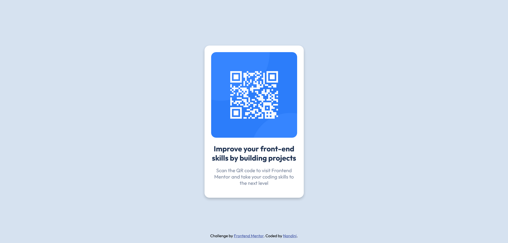

# Frontend Mentor - QR code component solution

This is my solution to the [QR code component challenge on Frontend Mentor](https://www.frontendmentor.io/challenges/qr-code-component-iux_sIO_H). 

## Table of contents

- [Overview](#overview)
  - [Screenshot](#screenshot)
  - [Links](#links)
- [My process](#my-process)
  - [Built with](#built-with)
- [Author](#author)

## Overview

### Screenshot

### Desktop

### Mobile

### Links

- Solution URL: [QR code component](https://github.com/NandiniCooppen/FRONTENDMENTOR-CHALLENGES/tree/master/qr-code-component-main)
- Live Site URL: [QR code component](https://your-live-site-url.com)

## My process

### Built with

- Semantic HTML5 markup
- CSS custom properties
- Flexbox

## Author

- Github - [Nandini](https://github.com/NandiniCooppen)
- Frontend Mentor - [@NandiniCooppen](https://www.frontendmentor.io/profile/NandiniCooppen)